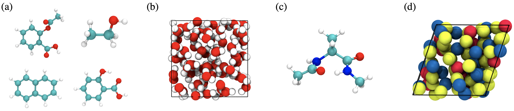

# Benchmarking ML for MD simulation

`mdsim` is a codebase for training and running molecular dynamics simulation with machine learning force fields. This implementation was tested under Ubuntu 18.04, Python 3.9, PyTorch 1.11, and CUDA 11.3. Detailed versions of other packages are listed in the [installiation guide](#install-other-dependencies). If you have any question, feel free to open an issue or reach out to `xiangfu@mit.edu`.

[[paper]](https://arxiv.org/abs/2210.07237)
[[dataset]](https://zenodo.org/record/7196767)



if you find this code useful, please consider reference in your paper:


```
@article{fu2022forces,
      title={Forces are not Enough: Benchmark and Critical Evaluation for Machine Learning Force Fields with Molecular Simulations}, 
      author={Xiang Fu and Zhenghao Wu and Wujie Wang and Tian Xie and Sinan Keten and Rafael Gomez-Bombarelli and Tommi Jaakkola},
      journal={arXiv preprint arXiv:2210.07237},
      year={2022},
}
```

## Installation

### create a conda environment

`deepmd-kit` is required for training and simulating MD with DeepPot-SE (or other models from DeePMD-kit). We recommend installing it with `conda` while creating a conda environment (use Bash):

```
conda create -n mdsim python=3.9.11 deepmd-kit=2.1.0=*gpu libdeepmd=2.1.0=*gpu lammps cudatoolkit=11.3 horovod -c https://conda.deepmodeling.com -c defaults
```

Alternatively, install a conda environment without `deepmd-kit`:

```
conda create -n mdsim python=3.9.11
```

### install other dependencies

After installing the conda environment, activate by running:

```
conda activate mdsim
```

Then install other dependicies by running:

```
pip install --user lmdb==1.1.1
pip install --user numba==0.55.1
pip install --user numpy==1.21.2
pip install --user PyYAML==6.0
pip install --user ray==2.0.0
pip install --user rdkit==2022.3.5
pip install --user scikit_learn==1.1.2
pip install --user scipy==1.7.3
pip install --user setuptools==61.3.1
pip install --user submitit==1.4.5
pip install --user sympy==1.7.1
pip install --user tqdm==4.63.1
pip install --user wandb==0.12.17
pip install torch==1.11.0+cu113 torchvision==0.12.0+cu113 torchaudio==0.11.0 --extra-index-url https://download.pytorch.org/whl/cu113
pip install --user torch-scatter torch-sparse torch-cluster torch-spline-conv -f https://data.pyg.org/whl/torch-1.11.0+cu113.html 
pip install --user pyg-nightly==2.0.5.dev20220418 
pip install --user git+https://gitlab.com/ase/ase.git@master
pip install --user nequip==0.5.4
```

Then install `mdsim` as a package:

```
pip install -e ./
```

### install PLUMED 

We use [PLUMED](https://www.plumed.org/) for the MetaDynamics enhanced sampling of alanine dipeptide. We recommend installing it using conda:

```
conda install -c conda-forge py-plumed plumed
```

You may need to install `libatlas-base-dev` first:

```
sudo apt-get install libatlas-base-dev
```

PLUMED also needs `ase` nightly. If you have previously installed `ase`, update it to the latest version:

```
pip install --upgrade git+https://gitlab.com/ase/ase.git@master
```


## Download/preprocess data

Download all preprocessed data at Zenodo:

[All datasets at Zenodo](https://zenodo.org/record/7196767)

The default path is `./DATAPATH`. Training should be immediately runnable if all preprocessed datasets are downloaded from Zenodo and the directory is properly renamed. Alternatively, the scripts for downloading and preprocessing each individual dataset are in `preprocessing/`. Specify `data_path` for the location of the saved source files, and specify `db_path` for the proprocessed files (Lmdb files for SchNet, DimeNet, etc. or npz files for NequIP). For example, download the MD17 `aspirin` dataset to `DATAPATH` and save processed files to `DBPATH` by running:

```
python preprocessing/md17.py --molecule aspirin --data_path DATAPATH --db_path DBPATH
```

Download the water dataset to `DATAPATH` and save processed files to `DBPATH`:

```
python preprocessing/water.py --data_path DATAPATH --db_path DBPATH
```

All datasets have unit eV for energy and ev/$\AA$ for forces. The mean and standard deviation of energy/forces are stored in `metadata.npy`.


## Train ML force fields

All training configs are stored in `configs/` except for DeepPot-SE. There are four datasets: `ala, lips, md17, water`. The implementations of SchNet, DimeNet, ForceNet, and GemNet are adapted from [OCP](https://github.com/Open-Catalyst-Project/ocp) are included in this repo. The training of NequIP directly calls the installed `nequip` package. Other models from OCP can be easily adapted to work with this repo.

We recommend logging with wandb and it is used by default. You need to have a wandb account and log in with `wandb init`. More details at https://wandb.ai/. You can use a different logger by changing `logger` in the `base.yml` config files.

### Training models implemented in OCP

Training is mostly through `main.py`. The training configs are included in `configs/`. You will need to modify `dataset.src` in `base.yml` for each dataset to the path where the processed data is saved. Run `main.py` to train a model while specifying the config. For example, train a SchNet on MD17 Aspirin with:

```
python main.py --mode train --config-yml configs/md17/schnet.yml --molecule aspirin
```

Or train a GemNet-T on water-1k with:

```
python main.py --mode train --config-yml configs/water/gemnet-T.yml --size 1k
```


### Training NequIP models

`main.py` can also be used for training an NequIP model, with the `--nequip` flag. This is done by calling the built-in command of `nequip`. For example, train NequIP on MD17 Aspirin with:

```
python main.py --mode train --config-yml configs/md17/nequip/aspirin.yml --nequip
```

Or train a NequIP model on water-1k with:

```
python main.py --mode train --config-yml configs/water/nequip/nequip_1k.yml --nequip
```


### Training DeepPot-SE

Training DeepPot-SE models is done by calling the built-in command of `deepmd-kit`. All training configs for DeepPot-SE are stored in `deeppot_se/`. You need to modify the `training.training_data.systems` and `training.validation_data.systems` to the paths of the datasets. For training, go to the corresponding directory (e.g., `deeppot_se/water1k` for water-1k) and run:

```
dp train input.json
```

## Simulate MD

Configs for simulating MD are stored in `configs/simulate/`. For example, simulate a model with OCP implementation trained on the water dataset by running:

```
python simulate.py --config_yml configs/simulate/water.yml --model_dir MODELPATH
```

`MODELPATH` is the directory containing the training files/logs. We include an example trained model in this repo. If you have downloaded the data and renamed it to `DATAPATH` in the project home directory, You can try evaluation and simulating MD by running:

```
python simulate.py --config_yml configs/simulate/water.yml --model_dir example_model/water_1k_schnet
```

The `--nequip` flag and a nequip data config are needed for simulating with NequIP. The data configs are stored in `configs/simulate/nequip_data_cfg`. For example, simulate a NequIP model for water by running:

```
python simulate.py --config_yml configs/simulate/water.yml --model_dir MODELPATH --nequip
```

The `--deepmd` flag is needed for simulating with DeepPot-SE. For example, simulate a DeepPot-SE model for water by running:

python simulate.py --config_yml configs/simulate/water.yml --model_dir MODELPATH --deepmd

Use the argument `--init_idx` to select a specific initial configuration. This is useful for simulating alanine dipeptide.

## Compute observables and evaluation

Some example simulations from trained models are in `example_sim/`. [observable.ipynb](./observable.ipynb) offers a guide on computing the observables reported in the paper.

Install the IPython kernel to use Jupyter notebook:

```
conda install ipykernel
python -m ipykernel install --user --name mdsim --display-name "mdsim"
```

`nglview` can be used to visualize MD simulations. We recommend installing it with conda:

```
pip install --user nglview
```

## Acknowledgements

This codebase is built off the [Open Catalyst Project](https://github.com/Open-Catalyst-Project/ocp) codebase. A significant amount of code is borrowed from [mdgrad](https://github.com/torchmd/mdgrad) and [NeuralForceField](https://github.com/learningmatter-mit/NeuralForceField). The MD simulation capabilities are built with [ASE](https://gitlab.com/ase/ase/-/tree/master/). The ML models are built with [PyG](https://github.com/pyg-team/pytorch_geometric). Simulation/training of [NequIP](https://github.com/mir-group/nequip) and [DeepMD-kit](https://github.com/deepmodeling/deepmd-kit) are built upon the original codebases.


